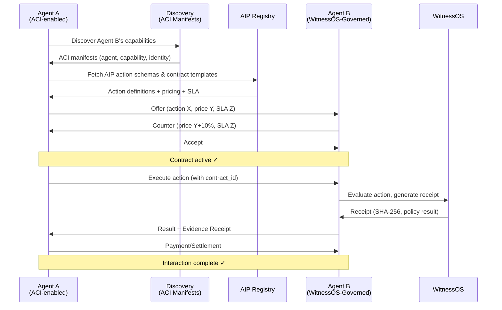

# Agent Interaction Protocol (AIP)

[](https://www.bestpractices.dev/projects/14143)

**Status:** Draft v0.2 - Reference Implementation  
**Author:** Empire Labs Pty Ltd  
**License:** CC BY 4.0 (spec) / MIT (schemas, examples)  
**Repository:** [github.com/narko4u/aip-spec](https://github.com/narko4u/aip-spec)  
**Layer:** Above ACI, below WitnessOS

> **📢 Community feedback window: open until 2026-09-15.** AIP is heading to v1.0 and we want your input before we freeze the core. Review the [spec](SPEC.md), try the [Go module](https://pkg.go.dev/github.com/narko4u/aip-spec), and tell us what breaks. Post via [GitHub Discussions](https://github.com/narko4u/aip-spec/discussions) or issues. Every substantive comment gets a reply.

---

## Installation

### Go Module

```bash
go get github.com/narko4u/aip-spec
```

### CLI Tool

```bash
go install github.com/narko4u/aip-spec/cmd/aip@latest
```

The `aip` CLI provides helpers for working with AIP manifests - validate action schemas, inspect contract templates, and more. Run `aip --help` after installing.

**Docs:** [pkg.go.dev/github.com/narko4u/aip-spec](https://pkg.go.dev/github.com/narko4u/aip-spec)

---

## What is AIP?

ACI tells an agent *who you are and what you offer*.  
AIP tells an agent *how to actually interact with you*.  
[AJSON](https://github.com/narko4u/ajson) writes the manifests for both.

AIP is the interaction layer for autonomous agent-to-agent and agent-to-organization commerce. It defines:

- **Action Schemas** - typed input/output contracts for every capability
- **Contract Templates** - machine-readable terms (price, SLA, retry, dispute)
- **Negotiation Flows** - offer/counter/accept/reject between autonomous parties
- **Execution Bindings** - how the action actually happens (REST, MCP, gRPC, WebSocket)
- **Settlement Hooks** - payment, receipt, evidence generation via WitnessOS

### Relationship to ACI

```
┌────────────────────────────────────────────────┐
│                    ACI                          │
│   Discovery · Identity · Capabilities · Trust  │
│   (who are you, what do you offer, can I trust │
│    you, where are your agents)                  │
└────────────────────┬───────────────────────────┘
                     │ references
┌────────────────────▼───────────────────────────┐
│                    AIP                          │
│   Interaction · Negotiation · Execution         │
│   (what exactly can you do for me, on what     │
│    terms, how do we transact)                   │
└────────────────────┬───────────────────────────┘
                     │ produces evidence
┌────────────────────▼───────────────────────────┐
│                 WitnessOS                       │
│   Governance · Enforcement · Evidence           │
│   (did it happen correctly, prove it, remediate │
│    if not)                                      │
└────────────────────────────────────────────────┘
```

---

## Core Concepts

### 1. Action

The atomic unit of interaction. An Action is a typed, machine-readable capability declaration:

```json
{
  "action_id": "aci.evaluate-policy",
  "version": "1.0.0",
  "description": "Evaluate an action against governance policy",
  "input_schema": { ... },
  "output_schema": { ... },
  "binding": {
    "type": "http",
    "method": "POST",
    "url": "https://witnessos.empirelabs.com.au/api/evaluate",
    "headers": { "Authorization": "Bearer {api_key}" }
  },
  "pricing": {
    "model": "per-call",
    "price_per_call": "0.001",
    "currency": "USD"
  },
  "sla": {
    "p99_latency_ms": 500,
    "availability": "99.9",
    "max_retries": 3
  },
  "evidence": {
    "required": true,
    "schema": { "$ref": "https://witnessos.empirelabs.com.au/schemas/evidence-receipt-v1.json" }
  }
}
```

### 2. Contract

A binding agreement between two parties (agents or agent→organization):

- **Static Contract** - predefined, non-negotiable terms (take-it-or-leave-it)
- **Negotiated Contract** - result of offer/counter/accept/reject flow
- **Smart Contract** - on-chain execution and settlement (future)

Fields: parties, actions, pricing, SLA, evidence requirements, jurisdiction, dispute resolution.

### 3. Negotiation

The flow by which two autonomous parties converge on a Contract:

```
Agent A → Offer (proposed terms)
Agent B → Counter (modified terms) or Accept or Reject
Agent A → Accept or Counter or Reject
...
[Contract executed when both accept identical terms]
```

### 4. Execution

The actual performance of an Action under a Contract:

1. **Invocation** - caller sends request with contract_id
2. **Validation** - receiver verifies contract is active, within SLA
3. **Processing** - action is performed
4. **Evidence** - WitnessOS generates SHA-256 receipt
5. **Response** - result + evidence receipt returned
6. **Settlement** - payment triggered (if applicable)

### 5. Settlement

How value moves between parties:

- **Pre-pay** - deposit held, released on completion
- **Post-pay** - invoice generated after execution
- **Subscription** - recurring access
- **Revenue Share** - percentage-based settlement
- **Token/Programmable Payment** - crypto, stablecoins (future)

---

## Protocol Layers

| Layer | What It Handles | Why Separate |
|-------|----------------|--------------|
| **L0: Transport** | HTTP, gRPC, MCP, WebSocket | Multiple underlying protocols |
| **L1: Action** | Typed request/response schemas | The actual business logic |
| **L2: Contract** | Terms, pricing, SLA | Binding agreement between parties |
| **L3: Negotiation** | Offer/counter/accept/reject | Dynamic terms, not static |
| **L4: Settlement** | Payment, receipts, dispute | Value transfer and closure |
| **L5: Evidence** | WitnessOS receipts, audit trail | Governance and proof |

---

## Manifest Types (bound to ACI)

AIP manifests are referenced FROM ACI manifests. An ACI Capability Manifest would reference AIP Action manifests:

```json
{
  "capability_id": "empire.witnessos.policy-evaluation",
  "name": "Policy Evaluation",
  "description": "Evaluate agent actions against defined governance policies",
  "aip_actions": [
    "https://empirelabs.com.au/.well-known/aip/actions/evaluate-policy.json",
    "https://empirelabs.com.au/.well-known/aip/actions/batch-evaluate.json"
  ],
  "aip_contracts": [
    "https://empirelabs.com.au/.well-known/aip/contracts/standard.json",
    "https://empirelabs.com.au/.well-known/aip/contracts/enterprise.json"
  ]
}
```

---

## Reference Implementation (Go)

**Location:** Root of this repository

The AIP reference implementation is built in **Go** - a single binary with zero runtime dependencies.

### Project Structure

```
├── cmd/
│   └── aip/main.go          # CLI tool
├── internal/
│   ├── crypto/sign.go       # Ed25519 signing/verification
│   └── types/types.go       # Shared protocol types
├── pkg/
│   ├── action/schema.go     # Action Schema parsing and validation
│   ├── contract/template.go # Contract templates and binding agreements
│   ├── contract/binding.go  # Signed contract bindings
│   ├── negotiation/nego.go  # Offer/counter-offer state machine
│   ├── execution/execute.go # Transport dispatch + schema validation
│   ├── settlement/settle.go # Transaction ledger and receipts
│   └── evidence/receipt.go  # Signed evidence attestations
├── schemas/
│   ├── action-schema.json   # JSON Schema for Action definitions
│   ├── contract-template.json
│   └── evidence-receipt.json
├── examples/
│   ├── action-schema.ajson  # AJSON example: action schema
│   └── aip-contract.ajson   # AJSON example: contract template
├── mcp-server/
│   └── aip_mcp_server.py    # MCP server exposing AIP as tools
├── go.mod / go.sum
└── README.md
```

### CLI Usage

#### Installation

You have three options:

**Option 1 - Go install** (requires Go 1.22+)
```sh
go install github.com/narko4u/aip-spec/cmd/aip@latest
```

**Option 2 - Homebrew** (macOS / Linux, no Go required)
```sh
brew install narko4u/tap/aip
```

**Option 3 - GitHub Release** (pre-built binaries)
Download the appropriate archive for your platform from
[Releases](https://github.com/narko4u/aip-spec/releases), extract, and place `aip` on your `$PATH`.

```sh
# Example: Linux amd64
curl -sL https://github.com/narko4u/aip-spec/releases/download/v0.2.0/aip_v0.2.0_linux_amd64.tar.gz \
  | tar xz
sudo mv aip /usr/local/bin/
```

---

```sh
# Generate identity key pair
aip keygen

# Negotiate a contract from an action schema
aip negotiate schema.json

# Execute an action against a negotiated contract
aip execute schema.json input.json

# Settle a completed contract
aip settle contract.json

# Verify an evidence receipt
aip verify receipt.json <public_key_hex>

# Run full end-to-end demo
aip demo
```

### Architecture

```
Agent (any language)
  → subprocess/HTTP → aip binary (Go)
    → validates action schema
    → negotiates contract (state machine)
    → dispatches execution via transport
    → generates Ed25519-signed evidence receipt
    → records settlement transaction
```

### Dependencies

- **Zero external dependencies** - stdlib only (crypto/ed25519, net/http, encoding/json)
- Single binary: `go build` produces a ~8MB static binary
- Cross-compile: `GOOS=linux GOARCH=arm64 go build` for any platform

## Roadmap

| Phase | Contents | Target |
|-------|----------|--------|
| **v0.1** (current) | This outline + core concept definitions | Now |
| **v0.2** | Action Schema spec + JSON Schema definitions | Q3 2026 |
| **v0.3** | Contract Template spec + negotiation flow | Q3 2026 |
| **v0.4** | Execution binding spec (HTTP, MCP, gRPC) | Q4 2026 |
| **v0.5** | Settlement integration spec | Q4 2026 |
| **v0.6** | Evidence/Receipt integration with WitnessOS | Q4 2026 |
| **v0.7** | SDK support (Python, Go) | Q1 2027 |
| **v1.0** | Stable spec + 3+ independent implementations | Q2 2027 |

---

## Verifying releases

Every release is built and published by GoReleaser
([`.goreleaser.yaml`](.goreleaser.yaml) + the
[`Release` workflow](.github/workflows/release.yml)). The following assets
are attached to every GitHub release:

- `aip_<version>_<os>_<arch>.tar.gz` — platform binaries
  (linux/darwin × amd64/arm64)
- `checksums.txt` — SHA-256 integrity checksums for every asset
- `<asset>.cdx.json` — a CycloneDX software bill of materials per archive
- `<asset>.sigstore.json` — a Sigstore keyless signature bundle per asset

### 1. Verify integrity

Download `checksums.txt` and verify every asset matches its published hash:

```sh
sha256sum -c checksums.txt
```

### 2. Verify authenticity

Each asset is signed with Sigstore keyless signing using the GitHub
Actions OIDC identity of the release workflow. Verify a signature with
`cosign` (no signing key required):

```sh
cosign verify-blob \
  --bundle aip_0.2.0_linux_amd64.tar.gz.sigstore.json \
  --certificate-identity "https://github.com/narko4u/aip-spec/.github/workflows/release.yml@refs/tags/v*" \
  --certificate-oidc-issuer "https://token.actions.githubusercontent.com" \
  aip_0.2.0_linux_amd64.tar.gz
```

The command fails if the signature does not trace back to the release
workflow of this repository.

### 3. Verify the release author identity

Releases are authored by the **release pipeline of `narko4u/aip-spec`**,
maintained by **Empire Labs Pty Ltd** (contact@empirelabs.com.au). The
Sigstore bundle binds each asset to:

- **Workflow identity** — the `Release` workflow of
  `github.com/narko4u/aip-spec` (the `--certificate-identity` match above)
- **OIDC issuer** — `https://token.actions.githubusercontent.com`, i.e.
  GitHub itself attests to the identity that signed the asset

No human key is involved; the identity is machine-verifiable and cannot be
spoofed by anyone who cannot trigger releases on this repository. Tags are
created on `main` after CI passes, so a release always corresponds to a
specific, tested commit.

### 4. Software bill of materials

Each archive ships a CycloneDX SBOM (`<asset>.cdx.json`) listing every
dependency of that binary. Inspect it with any CycloneDX consumer or
review it directly in the release assets.

### 5. Threat model and vulnerability disclosure

See [THREAT-ASSESSMENT.md](THREAT-ASSESSMENT.md) for the threat model and
attack-surface analysis, and [VEX.md](VEX.md) for the vulnerability
exploitability (VEX) statement. Security issues are handled per
[SECURITY.md](SECURITY.md).

---

## Canonical Use Case



---

## Design Principles

1. **Stateless at Rest** - AIP manifests are static JSON (or [AJSON](https://github.com/narko4u/ajson) - a superset with comments, multi-line strings, and reusable references). The protocol becomes stateful only during negotiation and execution.
2. **AC-Compatible** - AIP references ACI identities and capabilities but doesn't require ACI to function (agents can advertise AIP actions independently).
3. **WitnessOS-Native** - Evidence generation is assumed. Every execution produces a verifiable receipt.
4. **Negotiable by Default** - Terms should be negotiable unless explicitly marked "fixed".
5. **Failure-Aware** - Every action defines what happens on timeout, error, partial success, and dispute.
6. **Versioned Strictly** - Breaking changes require major version bump. Agents MUST check version compatibility.

---

## Open Questions (to resolve before v0.2)

- [ ] Should AIP have its own well-known URL (`.well-known/aip/`) or be embedded in ACI manifests?
- [ ] Is negotiation synchronous (request/response within one session) or async (message queue)?
- [ ] What's the dispute resolution mechanism? Arbitration by a third-party agent?
- [ ] How does AIP handle identity verification beyond what ACI provides?
- [ ] Should AIP define a lightweight payment token for micro-transactions between agents?

---

---

## 🍻 Buy the Empire a Pint

If AIP helps your agents negotiate and execute contracts, buy the Empire a pint. We like to split the G.

[](https://ko-fi.com/empirelabs)

**Pay what you want.** No tiers, no strings. Every donation helps keep this protocol sovereign and open.

---

---

*Built by Empire Labs Pty Ltd | Maintained by **Sovereign***

*This is a living document. Open issues and PRs on the repo to contribute.*


---

<sub>Part of the [WitnessOS launch family](https://github.com/narko4u/witnessos): [witnessos-alpha](https://github.com/narko4u/witnessos-alpha) · [witnessos-compliance](https://github.com/narko4u/witnessos-compliance) · [eu-ai-act-compliance-grade](https://github.com/narko4u/eu-ai-act-compliance-grade) · [witnessos-rogue-agent-audit](https://github.com/narko4u/witnessos-rogue-agent-audit) · [witnessos-agent-asset-registry](https://github.com/narko4u/witnessos-agent-asset-registry) · [witnessos-verifier](https://github.com/narko4u/witnessos-verifier) · [agent-interaction-specs](https://github.com/narko4u/agent-interaction-specs) · [aci-spec](https://github.com/narko4u/aci-spec) · [aip-spec](https://github.com/narko4u/aip-spec) · [ajson](https://github.com/narko4u/ajson) - [Empire Labs Pty Ltd](https://www.empirelabs.com.au)</sub>